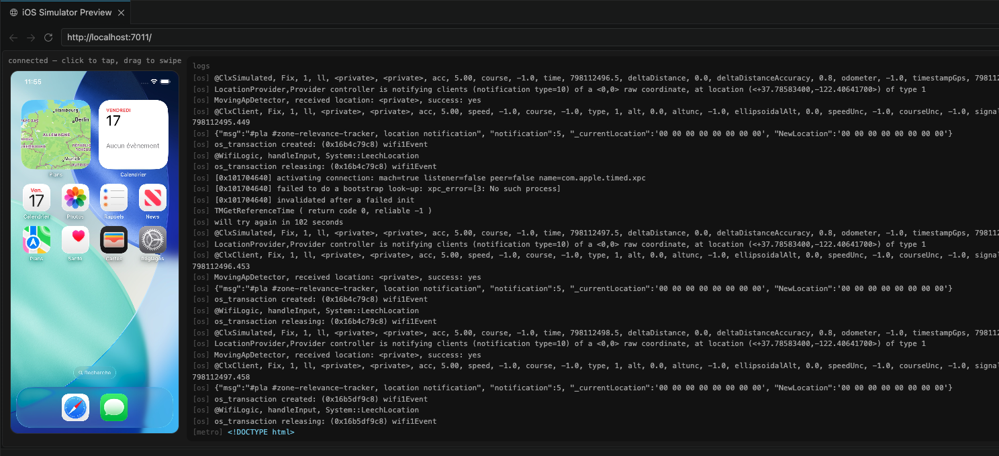

# Claude in iOS

**Claude can already drive any website. This makes iOS apps a website.**

Serves the booted iOS Simulator as a local webpage and bridges logs, events, and input between browser ⇄ simulator. This makes every existing Claude browser tool (`claude-in-chrome`) work against any Apple app — and exposes a Preview MCP so Claude Code and the agent SDK can auto-discover the simulator.



## vs Maestro MCP

[Maestro](https://maestro.mobile.dev) is a mobile UI testing framework with its own MCP server. Both let Claude interact with a simulator, but the philosophy is different:

| | claude-ios-simulator | Maestro MCP |
|---|---|---|
| **Interaction model** | Visual — simulator streams as a live webpage Claude's browser tools navigate | Headless — Claude calls discrete MCP tools (`tap_on`, `run_flow`) |
| **How Claude "sees"** | Browser MCP reads the actual rendered canvas pixels, same as a real website | Single screenshots on demand via `take_screenshot` tool |
| **Input targeting** | Absolute coordinates (x, y on screen) | Element-based (`tap_on "Login"` by text/label) |
| **Existing tools** | Any `claude-in-chrome` browser tool works out of the box — no new skills needed | Requires Maestro-specific tools and YAML flow syntax |
| **Platform** | iOS only | iOS + Android |
| **Live logs** | Metro + OS logs streamed in real time in the UI | Not included |
| **Hardware buttons** | Home, Lock, Volume, Siri, Apple Pay | Back button only |
| **Best for** | Visual exploration, debugging UI, running apps Claude has never seen | Repeatable automated test flows, element-level assertions |

The two are complementary: use Maestro for reliable regression flows, use this for ad-hoc visual interaction and log debugging.

## Architecture

```
Claude Code / Agent SDK
  |                  \
  | (browser MCP)     \ (Preview MCP, stdio)
  v                    v
Chrome + claude-in-chrome ──► Node server (this tool)
  |                               |  HTTP: static web app
  | clicks/keys on canvas         |  WS: frames out, input/logs in
  v                               v
http://localhost:7010/       xcrun simctl (stream, logs, openurl)
  |                          idb (tap, swipe, text, describe-all)
  └── WS input ─────────────►Metro /logs  (React Native)
```

## Prerequisites

```sh
# Xcode + simctl (comes with Xcode)
xcode-select --install

# idb for input control (tap/swipe/text)
brew install facebook/fb/idb-companion
pip install fb-idb
```

## Usage (local dev — from this repo)

```sh
npm run doctor                  # check prerequisites

# 1. Boot a simulator
xcrun simctl boot "iPhone 17 Pro"

# 2. Start the preview server
npm run dev                     # → http://localhost:7010/

# 3. Open the URL in Chrome with claude-in-chrome extension
```

To use as a global CLI (after building):

```sh
npm run link                    # builds + npm link
claude-ios-simulator            # now available globally
```

Options:
- `--port=7010` — change port (default 7010)
- `--udid=<UDID>` — target specific device (defaults to booted)

## Subcommands

```sh
npm run dev -- mcp              # stdio MCP server (for Claude Code)
npm run mcp                     # same, shorthand
npm run doctor                  # check prerequisites
npm run setup                   # register MCP with Claude Code (see below)
```

## Install MCP in Claude Code

Register this tool as a local MCP server so Claude Code can auto-discover the simulator:

```sh
# One-time setup — writes to ~/.claude.json
npm run setup

# Or manually with the Claude CLI:
claude mcp add ios-simulator-preview -- npx tsx /path/to/src/cli.ts mcp --port=7010

# Scope options:
claude mcp add --scope=local   ios-simulator-preview -- npx tsx src/cli.ts mcp
claude mcp add --scope=project ios-simulator-preview -- npx tsx src/cli.ts mcp
claude mcp add --scope=user    ios-simulator-preview -- npx tsx src/cli.ts mcp
```

After running, restart Claude Code. The `ios-simulator-preview` MCP will be available with tools like `get_preview_url`, `tap`, `screenshot`, etc.

## MCP Tools

When running as an MCP server (`mcp` subcommand), these tools are available:

| Tool | Description |
|------|-------------|
| `get_preview_url` | Returns `http://localhost:7010/` for the browser MCP |
| `boot` | Boot a simulator by UDID |
| `screenshot` | Single JPEG frame as base64 |
| `tap` | Tap at point coordinates |
| `swipe` | Swipe between two points |
| `type` | Type text into focused field |
| `open_url` | Open a URL / deep link |
| `describe_ui` | Full accessibility tree (JSON) |
| `logs_since` | Recent Metro or OS logs |

## launch.json integration (.vscode/launch.json)

Add to your Expo project's `.vscode/launch.json`:

```json
{
  "version": "0.2.0",
  "configurations": [
    {
      "name": "Expo iOS (Claude preview)",
      "type": "reactnative",
      "request": "launch",
      "platform": "ios",
      "path": "http://localhost:7010/",
      "previewMcp": {
        "command": "npx",
        "args": ["-y", "claude-ios-simulator", "mcp", "--port=7010"],
        "transport": "stdio"
      }
    }
  ]
}
```

Claude Code reads `previewMcp` to spawn the MCP server, calls `get_preview_url`, then points `claude-in-chrome` at that URL automatically. The `path` field is a fallback for non-MCP-aware tools.

## Web UI

The web page shows:
- **Left:** live simulator canvas. Click to tap; drag to swipe. Coordinates are scaled to device points automatically.
- **Right:** streaming Metro + OS log panel (color-coded by source).

## Streaming notes

Screenshots are captured via `xcrun simctl io booted screenshot --type=jpeg` in a loop. Realistic throughput on Apple Silicon is **5–8 fps** (60–120 ms per frame). Input feedback is optimistic client-side. For higher fps post-POC, migrate to `recordVideo | ffmpeg → fMP4 → WebCodecs`.

## Coordinate scaling

The canvas renders scaled JPEGs. The server fetches device point dimensions from `simctl list devices -j` and the client divides CSS-pixel clicks by the canvas CSS scale, then the server multiplies by `pointWidth / jpegWidth` before calling `idb`. Taps land correctly on all device sizes.
